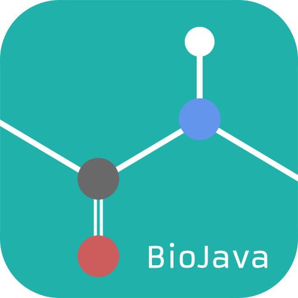

# Peptide-Bond BioJava Logo

# Contact Info

- Author: Aleix Lafita
- Email: aleixlafita@gmail.com
- Github: github.com/lafita

# Description

The peptide bond links amino acids together to generate proteins, the working units of biology. 
Likewise, the *BioJava Project* brings together a large community of programmers to provide software solutions for bioinformatics.

The logo is designed with a flat ball and stick representation of the peptide bond as a negative space figure in a green background. Balls are colored by their atom type (black Carbon, red Oxygen, blue Nitrogen and white Hydrogen). 
The word **BioJava** is written at the bottom-left part of the logo with the font type [Armata](https://www.fontsquirrel.com/fonts/armata).
